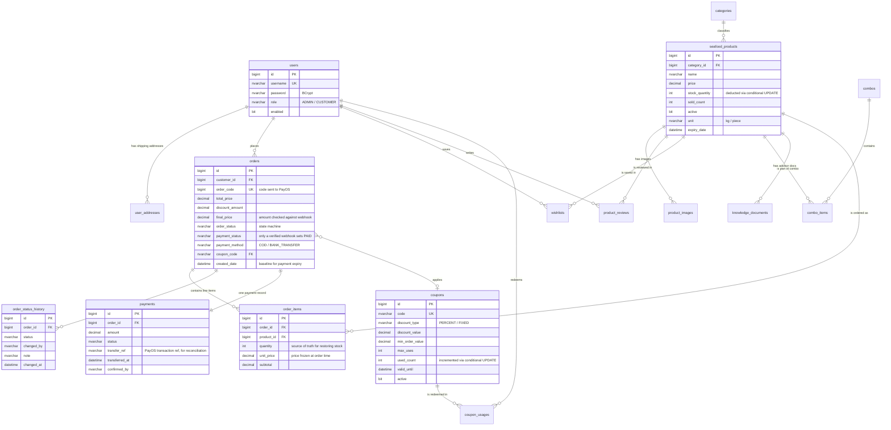

# Entity Relationship Diagram

16 tables across 4 business areas. The diagram shows keys and the columns that matter for business
logic; full definitions are in [`schema.sql`](schema.sql).

## Design decisions worth explaining

**`order_items` stores `unit_price` and `product_name`.** Seafood prices change daily. Joining to
`seafood_products` for the price would make old invoices show today's price — wrong when a customer
disputes a charge. The price is snapshotted at order time.

**`order_items.quantity` is the single source of truth for restoring stock.** When an order is
cancelled, the quantity to return is read from here rather than from the session cart, because the
session may already have been cleared or changed.

**`orders.order_code` is a separate code sent to PayOS**, distinct from `orders.id`. PayOS requires an
integer that we generate; keeping it separate from the primary key avoids exposing the real order
sequence externally.

**`orders.final_price` is stored, not recomputed.** The PayOS webhook reports the amount paid, so a
fixed server-side figure is needed to compare against — it cannot be recalculated from the cart.

**`order_status_history` is a separate, append-only table.** We need to know who changed the status,
when, and why; a single `order_status` column on `orders` cannot hold history.

**`payments.transfer_ref` holds the PayOS transaction reference.** When reconciling against a bank
statement, this is the link between a statement line and an order in the system.
