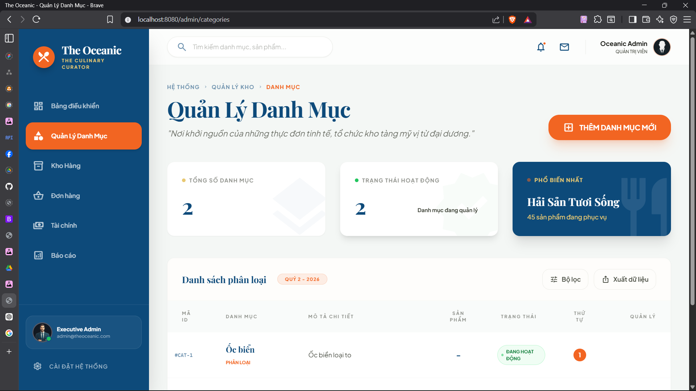

# Review task - Ngày 17/04/2026

## Tổng quan
Thực hiện khởi tạo cấu trúc dữ liệu cho dự án và triển khai các dịch vụ CRUD cơ bản cho hai thực thể chính là **Category** (Danh mục) và **Product** (Sản phẩm hải sản).

## Nội dung chi tiết

### 1. Khởi tạo Thực thể (Entities)
Đã thiết kế và khởi tạo 16 thực thể chính dựa trên sơ đồ cơ sở dữ liệu:
- `User`, `UserAddress`, `Wishlist`: Quản lý người dùng.
- `Category`, `SeafoodProduct`, `ProductImage`, `ProductReview`: Quản lý sản phẩm.
- `Order`, `OrderItem`, `OrderStatusHistory`, `Payment`: Quy trình đặt hàng.
- `Combo`, `ComboItem`: Quản lý các gói sản phẩm.
- `Coupon`, `CouponUsage`: Hệ thống khuyến mãi.
- `KnowledgeDocument`: Tài liệu hướng dẫn/kiến thức RAG.

### 2. Triển khai Category (Danh mục)
- **Repository**: `CategoryRepository` kế thừa JpaRepository.
- **Service**: 
    - `findAll`, `findById`, `findByActiveTrue`.
    - `save`, `update`, `deleteById`.
- **Admin Controller**: Triển khai các controller quản trị để quản lý danh sách danh mục.

### 3. Triển khai SeafoodProduct (Sản phẩm)
- **Repository**: `SeafoodProductRepository`.
- **Service**:
    - Triển khai Logic CRUD cơ bản.
    - Xử lý ràng buộc với `Category` khi lưu sản phẩm.
    - Tự động cập nhật `createdDate`, `updatedDate` và mặc định `soldCount = 0`.
- **Admin Controller**: Triển khai các controller quản trị để quản lý sản phẩm trong hệ thống admin.

## Kết quả đạt được
- [x] Hệ thống Entity hoàn chỉnh, sẵn sàng cho việc phát triển các tính năng nghiệp vụ.
- [x] Cơ bản hoàn thiện logic quản lý Catalog (Danh mục & Sản phẩm).

