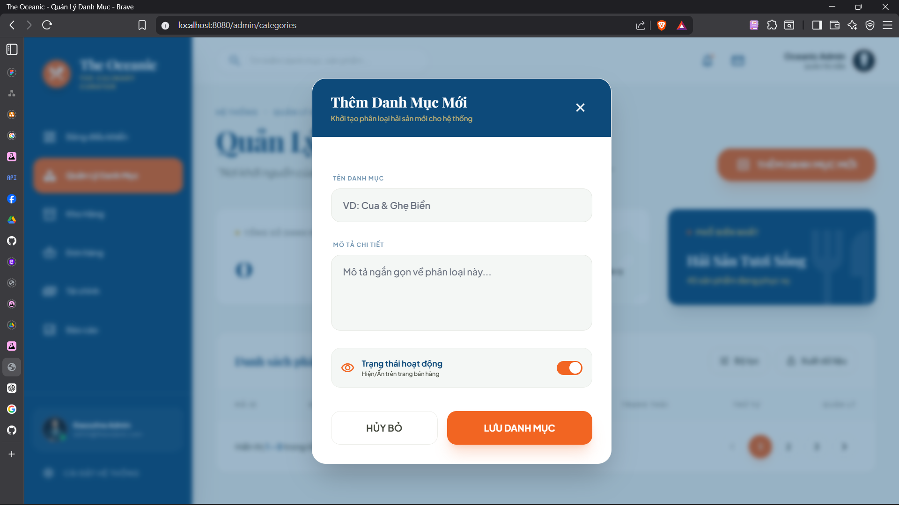

# Review task - Ngày 18/04/2026

## Tổng quan
Thực hiện hiện đại hóa giao diện quản lý sản phẩm, đồng bộ hóa trải nghiệm người dùng (UX) và tối ưu hóa cấu hình hệ thống để đảm bảo tính ổn định và thẩm mỹ đồng nhất.

## Nội dung chi tiết

### 1. Đồng bộ hóa Giao diện (UI/UX) - Quản lý Sản phẩm
- **Thiết kế Premium**: Nâng cấp file `product-manage.html` theo phong cách "The Oceanic" (sử dụng Tailwind CSS, font Playfair Display và Plus Jakarta Sans).
- **Hệ thống Modal**: 
    - Loại bỏ việc chuyển trang khi Thêm/Sửa sản phẩm. 
    - Triển khai các Popup Modal tương tác mượt mà giúp người dùng không bị gián đoạn trải nghiệm.
- **Thẻ Thống kê (Stats Cards)**: Hiển thị trực quan các chỉ số: Tổng sản phẩm, Sản phẩm đang bán, và Sản phẩm sắp hết hàng (tồn kho < 10).

### 2. Tối ưu hóa Backend (`SeafoodProductController`)
- **Tích hợp Logic Thống kê**: Tính toán dữ liệu thực tế từ Database để cung cấp cho View Dashboard.
- **Chuẩn hóa controller**: Đồng nhất các đường dẫn điều hướng (Redirect) và bổ sung hỗ trợ thông báo (Flash Messages) sau khi thực hiện CRUD.

### 3. Đồng bộ hóa Thanh điều hướng (Sidebar)
- **Trạng thái Active tự động**: Cập nhật logic để Sidebar tự động nhận diện và làm nổi bật tab tương ứng với Controller đang truy cập.
- **Sửa lỗi cú pháp Thymeleaf**: Khắc phục lỗi `SpelParseException` liên quan đến việc escape ký tự trong thuộc tính `th:style` của Icon.

### 4. Cấu hình Hệ thống & Database
- **Tối ưu DDL**: Chuyển cấu hình `spring.jpa.hibernate.ddl-auto` từ `create` sang `update`.
- **Kết quả**: Loại bỏ các log lỗi "Drop Constraint" vô nghĩa của SQL Server khi khởi động, giúp log hệ thống sạch và dễ theo dõi hơn.

## Kết quả đạt được
- [x] Giao diện Admin đồng nhất, hiện đại và đạt chuẩn Premium.
- [x] Luồng nghiệp vụ CRUD sản phẩm hoạt động ổn định qua Modal.
- [x] Hệ thống log khởi động sạch lỗi, Sidebar điều hướng thông minh.

---
