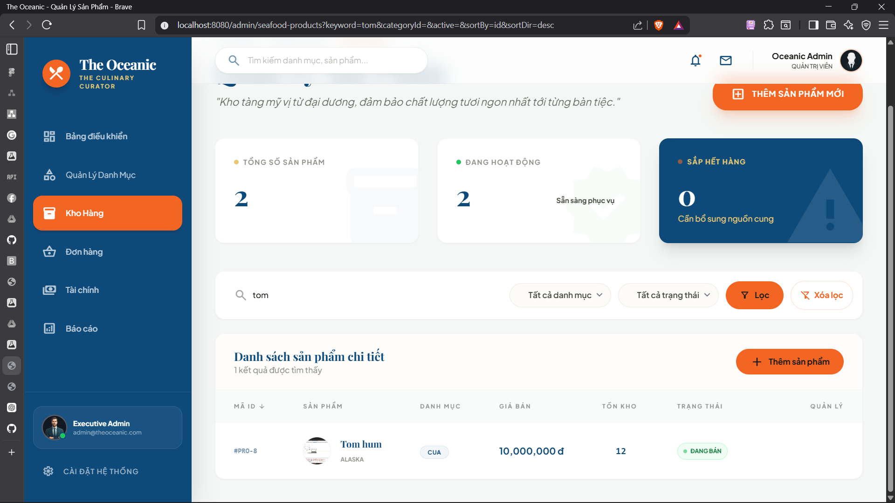

# Review task - Ngày 20/04/2026

## Thành viên thực hiện: vinhung

---

## Tính năng: Hệ thống Truy vấn Sản phẩm Thông minh

Hôm nay đã hoàn thành bộ công cụ Truy vấn (Search, Filter, Sort) giúp việc quản lý danh sách sản phẩm trở nên chuyên nghiệp và nhanh chóng hơn.

### 1. Tìm kiếm (Search)
- [x] Triển khai tìm kiếm theo từ khóa (Keyword) trên cả **Tên sản phẩm** và **Mô tả**.
- [x] **UX Tip**: Thêm phím tắt `/` để focus nhanh vào ô tìm kiếm.

### 2. Bộ lọc động (Dynamic Filtering)
- [x] **Theo Danh mục**: Lọc chính xác sản phẩm thuộc từng loại hải sản.
- [x] **Theo Trạng thái**: Phân loại sản phẩm Đang bán / Tạm ngưng.
- [x] **Lọc nhanh**: Cơ chế lọc sản phẩm sắp hết hàng (Tồn kho < 10).
- [x] **UI/UX**: Thiết kế lại nút **"Xóa lọc"** dạng Ghost Button, chỉ hiện khi có bộ lọc đang hoạt động để làm sạch giao diện.

### 3. Sắp xếp (Sorting)
- [x] Click trực tiếp vào tiêu đề các cột: Mã ID, Tên, Giá bán, Tồn kho.
- [x] Tự động đảo chiều sắp xếp (Tăng dần/Giảm dần) kèm icon chỉ dẫn.

### 4. Công nghệ & Giải quyết vấn đề
- [x] **JPA Specification**: Sử dụng `Criteria API` để xây dựng câu truy vấn động phía Backend.
- [x] **Fix Bug**: Xử lý lỗi `NCLOB` khi dùng hàm `lower()` trên trường mô tả trong SQL Server.

---

## Trạng thái ứng dụng
- **Backend**: Đã cập nhật Repository, Service và Controller hỗ trợ các tham số truy vấn.
- **Frontend**: Giao diện bảng đã được tích hợp đầy đủ các điều khiển (controls).

