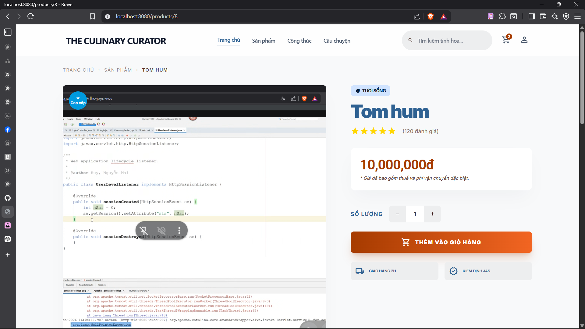

# Review task - Ngày 20/04/2026

## Thành viên thực hiện: vinhung

### Hệ thống Quản trị (Admin Dashboard)
- **Bộ lọc & Tìm kiếm (Filter, Search, Sort)**:
    - Triển khai `JpaSpecificationExecutor` và `SeafoodProductSpecification` cho phép tìm kiếm đa năng (tên, danh mục, trạng thái động).
    - Tối ưu UI: Nút "Xóa lọc" tinh tế, phím tắt `/` để focus ô tìm kiếm.
    - Sắp xếp (Sort): Hỗ trợ sắp xếp theo Giá, ID, Tên, Số lượng trực tiếp trên Header của bảng.

### Giao diện Người dùng (User UI)
- **Modular hóa Giao diện**:
    - Tách `header.html` và `footer.html` thành các Fragments riêng biệt để dễ dàng bảo trì.
    - Nhúng Fragment vào các trang bằng `th:replace`.
- **Trang Chi tiết Sản phẩm (`product-deatail.html`)**:
    - Chuyển đổi từ HTML tĩnh sang Thymeleaf động 100%.
    - Logic hiển thị ảnh: Tự động nhận diện ảnh chính (`isPrimary`) để hiển thị đại diện lớn, và lặp danh sách ảnh phụ bên dưới.
    - Hiển thị thông tin thực tế: Tên, Giá (format tiền tệ VN), Mô tả, Trạng thái tươi sống.
- **Trang Chủ (`home.html`)**:
    - Xây dựng layout trang chủ đẳng cấp với Hero Section và danh sách sản phẩm mới nhất.
    - Triển khai `HomeController` để đổ dữ liệu sản phẩm từ Database lên trang chủ.

## 2. Các vấn đề kỹ thuật đã giải quyết
- **Lỗi NCLOB/Lower Case**: Xử lý lỗi khi tìm kiếm trên trường Description (kiểu dữ liệu LOB) trong Specification.
- **Lỗi Template Parsing**: Khắc phục lỗi SpEL `EL1004E` khi nhầm lẫn giữa kiểu `Enum` và `String` cho trường `freshnessStatus`.
- **Cấu trúc Controller**: Refactor tách `HomeController` và `ProductClientController` để quản lý logic trang người dùng rõ ràng hơn.

## 3. UI/UX Polishing
- Thêm Class CSS `.star` để đồng bộ màu sắc sao đánh giá.
- Premium Badge: Tự động hiển thị huy hiệu "Cao cấp" cho các sản phẩm có giá trị cao.
- Hover Effects: Tối ưu các hiệu ứng chuyển động khi rê chuột vào ảnh sản phẩm.

---

